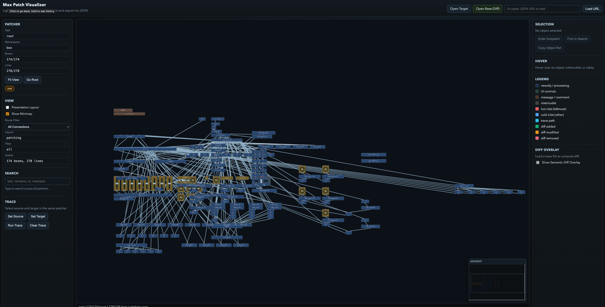

# maxmsp-utils

[](https://github.com/user1303836/maxmsp-utils/actions/workflows/validate-patches.yml)


[](./LICENSE)

Utility patches and tooling for Max/MSP and Max for Live, with an AI-agent-first development workflow.

[Visualizer](#visualizer) • [Patch Evolution Policy](#patch-evolution-policy) • [Contributing](./CONTRIBUTING.md) • [License](./LICENSE)

---

## Overview

This repository is a growing library of utility patches and supporting tools:

- Max patch/device assets (`.maxpat`, `.amxd`)
- patch validation and policy enforcement scripts
- a lightweight read-only visualizer for inspecting patch topology

## Repository Layout

| Area                   | Purpose                            | Path                                                      |
| ---------------------- | ---------------------------------- | --------------------------------------------------------- |
| Patches                | Canonical patch sources            | `patches/`                                                |
| Visualizer             | Browser-based Max patch visualizer | `tools/maxpat_visualizer/`                                |
| Query + analysis tools | Patch graph/query utilities        | `tools/maxpat_query.py`                                   |
| Validation tools       | Policy + structural validation     | `tools/check_patch_policy.py`, `tools/validate_maxpat.py` |
| Process docs           | Patch evolution guardrails         | `docs/PATCH_EVOLUTION_POLICY.md`                          |

## Visualizer

A lightweight patch visualizer is available at `tools/maxpat_visualizer/`.



It supports:

- interactive patch browsing and subpatch drill-in
- search and object inspection
- optional semantic diff overlay (base vs target)
- directed route trace highlighting

Run locally:

```bash
python3 -m http.server 8765
```

Then open:

```text
http://localhost:8765/tools/maxpat_visualizer/index.html
```

For full visualizer usage notes, see `tools/maxpat_visualizer/README.md`.

## Patch Evolution Policy

Patch files (`.maxpat` / `.amxd`) are the source of truth in this repo.
Scripted patch transforms are treated as one-time migrations only.

Policy details:

- `docs/PATCH_EVOLUTION_POLICY.md`

## CI and Validation

CI enforces patch policy and structural validation through the `Validate MaxMSP Patches` workflow.

Checks run:

- `python3 tools/check_patch_policy.py`
- `python3 tools/validate_maxpat.py`

Run the same checks locally before pushing:

```bash
python3 tools/check_patch_policy.py
python3 tools/validate_maxpat.py $(find . \( -name '*.maxpat' -o -name '*.amxd' \) | sort)
```

## Contributing

Contributions are welcome. See the full guide in `CONTRIBUTING.md`.

Quick checklist:

1. Create a worktree/branch for your change.
2. Treat patch files as canonical outputs.
3. Run local validation before opening a PR.
4. Include a concise summary and validation notes.

## Current Limitations

There is no native test runner equivalent for Max patches in this repository. Full runtime E2E testing in CI is constrained by Max licensing and macOS/display requirements.

Until that setup exists, static policy and structural checks are the primary CI quality gate.

## License

This project is licensed under the MIT License.
See `LICENSE` for details.
